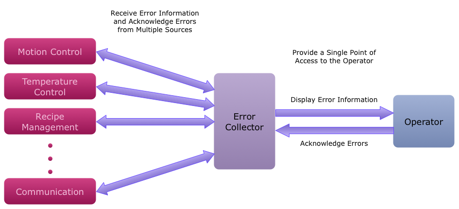

#ErrorLib Library
The ErrorLib library collects all machine component errors into one location for easy display and acknowledgement of errors.

Error handling is an integral part of any system. It is often undervalued, though, since it does not directly add functionality. To make matters worse, there is often inconsistency in error handling at the component level, which makes error handling at the system level much more difficult and far less portable. The end result is longer development time.

The ErrorLib library was developed to solve these problems. It gathers errors from different machine components into one place, effectively solving the problem of system level error handling. It consolidates all of the pertinent error status information, such as the source of the error and the error text, and provides one point of access to acknowledge these errors.

#Usage
The ErrorLib functionality can be integrated into any project using a couple of data structures and a few function calls. For an example of how to use this in a project, please see the ARG Automation Studio Starter Project at [https://github.com/autresgrp/StarterProject](https://github.com/autresgrp/StarterProject).

##Initialization
To use the ErrorLib functionality, a variable must be declared of type **ErrorCollector_typ**. This variable must then be initialized in the INIT routine of your program by calling the **ErrorCollectorFn_Init()** function.

	ErrorCollectorFn_Init( ErrorCollector );

The ErrorCollector uses meaningful default values for configuration settings, but these can be changed before calling the **ErrorCollectorFn_Init()** function if necessary.
 
Once the ErrorCollector is initialized, sources can be added. Once a source is added, the ErrorCollector will be able to display and acknowledge errors from that source. Each source **must** have a BOOL which signifies that an error exists. Additionally, each source can have the following:

* Display name for the source (STRING[120])
* Error text (STRING[329])
* Error ID (UINT)
* Acknowledge command (BOOL)

Sources can be added in two ways, by variable addresses or by variable name. The **errcolAddSourceByAddress()** function is used to add a source by variable addresses. To do so, simply provide the addresses of the error status information and the acknowledge command. If any variables do not exist for a given source, use a 0 in place of the variable address.

	errcolAddSourceByAddress(	ADR('Source Name 1'),
								ADR(Source1.statError),
		  						ADR(Source1.statErrorString),
		  						ADR(Source1.statErrorID),
		  						ADR(Source1.cmdAcknowledge),
								ErrorCollector );

	errcolAddSourceByAddress(	ADR('Source Name 2'),
								ADR(Source2.statError),
		  						0,
		  						ADR(Source2.statErrorID),
		  						0,
								ErrorCollector );

The **errcolAddSourceByName()** function is used to add a source by variable name. This function assumes that the variable name given is a structure that conforms to a certain standard. The error collector can be configured to accommodate different designs using the **ErrorCollector.IN.CFG.StructureElementNames**. The configured element name will be added to the variable name to determine where to obtain information. If nothing is configured for **ErrorCollector.IN.CFG.StructureElementNames**, the following default values are used:

* Error active (BOOL): Source.OUT.STAT.Error
* Error text (STRING[329]): Source.OUT.STAT.ErrorString
* Error ID (UINT): Source.OUT.STAT.ErrorID
* Acknowledge command (BOOL): Source.IN.CMD.AcknowledgeError

Only the error active BOOL is required; all other items are optional. For global variables, the name of the variable is sufficient. For local variables, the variable name must be preceded by the task name and a colon.

	errcolAddSourceByName(	ADR('Source Name 3'),
							ADR('GlobalSource3'),
							ErrorCollector );

	errcolAddSourceByName(	ADR('Source Name 4'),
							ADR('TaskName:LocalSource4'),
							ErrorCollector );

##Cyclic Operation
The **ErrorCollectorFn_Cyclic()** function must be called in the CYCLIC routine of your program once every scan, unconditionally.

	ErrorCollectorFn_Cyclic( ErrorCollector );

Any source errors that occur are automatically entered into the error list, **ErrorCollector.OUT.ErrorInfo[]**. Each item in the list contains the time that the error occurred, the name of the error source, the error text, the error ID number, and whether or not the error has been acknowledged through the ErrorCollector.

It is also possible to add errors to the list using the **errcolAddError()** function. This function will add an error into the error list immediately, making it easier to add multiple errors which occur at the same time. The **errcolAddError()** function has inputs for the source name, error text, error ID and the address of an acknowledge command, all of which are optional.

	errcolAddError(	ADR('Source Name 3'),
					ADR(GlobalSource3.OUT.STAT.ErrorString),
		  			GlobalSource3.OUT.STAT.ErrorID,
					ADR(GlobalSource3.IN.CMD.AcknowledgeError),
		  			ErrorCollector );

Individual errors can be acknowledged by setting **ErrorCollector.IN.PAR.ErrorIndex** to the index of the error and setting **ErrorCollector.IN.CMD.AcknowledgeErrorAtIndex** to 1. Alternatively, all of the errors can be acknowledged at once by setting **ErrorCollector.IN.CMD.AcknowledgeAllErrors** to 1. When an error is acknowledged through the ErrorCollector, the ErrorCollector will issue an acknowledge command to the source. Errors will remain in the error list until they are no longer present and have been acknowledged through the ErrorCollector. Since the ErrorCollector cannot tell if errors added by the **errcolAddError()** function are still present, these errors will be removed from the list as soon as they are acknowledged.

By default, errors are also logged using the Automation Runtime (AR) logger system. This provides an error history which is available through functionality in the HMITools library, or via Automation Studio or the System Diagnostics Manager (SDM). For details, please see the AS online help for the logger, the SDM, and the AsArLog library.

##HMI Integration
The HMI interface can be used to provide an easy way for the machine operator to acknowledge errors. The **ErrorCollector_HMI** structure is designed to make HMI development as simple as possible. The structure elements are organized by HMI object (button, listbox, etc.), and the basic element names are consistent with Visual Components property names. The **ErrorCollectorFn_HMI_Cyclic()** function handles everything necessary for easily displaying and acknowledging errors with the HMI.

For an example of a fully implemented HMI interface, please see the ARG Automation Studio Starter Project at [https://github.com/autresgrp/StarterProject](https://github.com/autresgrp/StarterProject).

#Reference

##Error Collector Data Structure
The main data structure of the ErrorLib library is the ErrorCollector structure (ErrorCollector_typ datatype). This provides the interface to higher level programs and also stores all necessary internal information. It is divided into inputs (ErrorCollector.IN), outputs (ErrorCollector.OUT), and internals (ErrorCollector.Internal).

###Inputs
The ErrorCollector inputs are divided into commands (IN.CMD), parameters (IN.PAR), and configuration settings (IN.CFG). Commands are used to initiate operations, and parameters and configuration settings determine how the commands will be processed. The difference between parameters and configuration settings is that configuration settings are generally set only once, while parameters might be set any time a command is issued.

####Commands
* **AcknowledgeError** - Acknowledge any errors local to the ErrorCollector itself.
* **AcknowledgeErrorAtIndex** - Acknowledge one error in **OUT.ErrorInfo[]** at **IN.PAR.ErrorIndex**.
* **AcknowledgeAllErrors** - Acknowledge all errors in **OUT.ErrorInfo[]**.

####Parameters
* **ErrorIndex** - Index of the error to acknowledge with **IN.CMD.AcknowledgeErrorAtIndex**.

####Configuration Settings
* **ErrorCollectorSourceName** - Source name to be used for ErrorCollector internal errors. The default value is 'Error Collector.'
* **MaxSources** - Maximum number of error sources. The default value is 100 sources.
* **StructureElementNames** - This contains the names of the structure elements which define the error source design. For example, if the error active BOOL for sources is located at **Source.output.error**, then the **ErrorCollector.IN.CFG.StructureElementNames.ErrorActive** should be set to '**output.error**'. Note that the '.' between the source name and the structure element should NOT be included in the configuration data. The default values are 'OUT.STAT.Error', 'OUT.STAT.ErrorString', 'OUT.STAT.ErrorID', and 'IN.CMD.AcknowledgeError'.
* **DisableLogging** - Disable logging of errors in the AR logging system when set to 1. The default value is 0.
* **LoggerName** - Name of the logger to use. For details, see the help for the AsArLog and LogThat libraries. The default value is 'Errors.'

###Outputs
The ErrorCollector outputs contain status information (OUT.STAT), the number of errors present (OUT.ErrorCount), and the error list (OUT.ErrorInfo[]).

####Error Collector Status Outputs
* **Error** - An error exists with the ErrorCollector itself. **Error** is reset with the **AcknowledgeError** command. ErrorCollector errors are also entered into the main error list, **OUT.ErrorInfo[]**, and can be acknowledged via **AcknowledgeErrorAtIndex** and **AcknowledgeAllErrors** commands.
* **ErrorID** - Current ErrorCollector error ID number.
* **ErrorString** - Current ErrorCollector error text.
* **ErrorCount** - Number of errors currently in the error list.

####Error List
* **Timestamp** - Time the error occurred.
* **SourceName** - Name of the source of the error.
* **ErrorString** - Error text of the error.
* **ErrorID** - Error ID number of the error.
* **Acknowledged** - The error has been acknowledged through the ErrorCollector.
* **SourceIndex** - Index of the source of the error. This is used internally and depends on the order in which sources were added to the ErrorCollector.
* **SourceTask** - For errors tracked by a source, the name of the task in which the source was added. For errors added using the **errcolAddError()** function, the name of the task in which the error was added. This can be useful debug information.
* **pAcknowledge** - Address of the acknowledge command associated with the error.

##ErrorCollector_HMI Data Structure
The ErrorCollector_HMI structure (ErrorCollector_HMI_typ datatype) is organized based on HMI objects. It contains the error list string array and control elements for a listbox to display the errors. Since listboxes do not support items with multiple lines, there is an error text string to display the full error information in a text box. There is also a search string for limiting the number of errors displayed, along with Acknowledge and Acknowledge All buttons.

This data structure relies on basic data types defined in the HMITools library. Please see the HMITools documentation for a description of these fundamental types.

##Error ID Numbers
* 3300-3336, 9133, 14700-14714 - These errors are passed along from the sys_lib library. Check the name of the error source variable and the configured StructureElementNames. For more information, see the AS online help for the sys_lib library.
* 58200-58203, 58300-58302 - These errors are passed along from the BRSE_ARL and LogThat libraries used to log errors. Check the LogThat logger structure. For more information, see the documentation for the BRSE_ARL and LogThat libraries.
* 50001 - ERRCOL_ERR_ALLOC - Error allocating memory for sources.
* 50002 - ERRCOL_ERR_INVALIDINPUT - Invalid function input.
* 50003 - ERRCOL_ERR_NOTINIT - Error collector is not initialized. **ErrorCollectorFn_Init()** must be called before the error collector can be used.
* 50004 - ERRCOL_ERR_FULLSOURCES - Error collector is full. No more sources can be handled. Check IN.CFG.MaxSources.
* 50005 - ERRCOL_ERR_FULLERRORS - Error collector is full. No more errors can be handled until some current errors are acknowledged.
* 50006 - ERRCOL_ERR_INVALIDSOURCE - Invalid source. Suggest reinitializing error collector.
* 50007 - ERRCOL_ERR_INVALIDERROR - Invalid error. Check IN.PAR.ErrorIndex.
* 50008 - ERRCOL_ERR_EMPTYLIST - Tried to remove an error from an empty list.
* 50009 - ERRCOL_ERR_INCONSISTENTERROR - The error addition process was interrupted by another error addition. While this is highly unlikely, an **AcknowledgeAllErrors** command is required to recover full ErrorCollector functionality after this error occurs.
