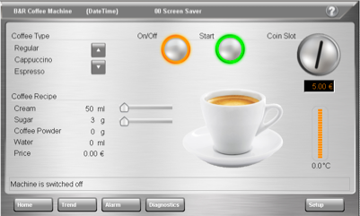

#HMITools Library
The HMITools library creates easy interaction functionalities with Visual Components and the HMI. 

Having a well designed operator interface that is easy to use can greatly advance efficiency and safety in a manufacturing process. Development of a intuitive HMI can add a significant amount of time and can be very tedious to design and implement.

HMITools library was developed to give more tedious functionalities a simple and clean interface from your program to the HMI. This allows a significant decrease in development time and increases usability for the operator.

#Usage
The HMITools functionality can be integrated into any project using a couple of data structures and a few function block calls. For an example of how to use this in a project, please see the ARG Automation Studio Starter Project at [https://github.com/autresgrp/StarterProject](https://github.com/autresgrp/StarterProject).

##HMIDirectory()
The HMIDirectory function block allows for easy integration of directory browsing, file name filtering, and file extension filtering with a “Listbox” and “Dropdown” controls in Visual Components.

To use the basic functionality of the FUB: view files with a selected file extension, located in a configured FileDevice. Five inputs are needed and the function block to be called cyclically, once every scan, unconditionally.  

The name of the configured file device location, **FileDevice**, pointer to the location of an array of strings of length **LIST_BOX_STRING_SIZE** that will be populated with the filtered files and directories from the configured location, **pFileList**, the size of the **pFileList** array, **MaxFiles**, pointer to the location of an array of strings of length **LIST_BOX_STRING_SIZE** for a list filtering file extensions, **pFileExtList**, the size of the **pFileExtList** array,**MaxExt**. 
Map the input variables **FileIndex** and **FileExtIndex** to their individual **IndexDatapoint** of the Dropdown or Listbox in the visualization, one for each FileList and FileExtList. Selecting the **FileIndex** or **FileExtIndex** will modify the **FileSelection** or **FileExtSelection** input/output.

	HMIDirectory_0.Enable:=				TRUE;
	HMIDirectory_0.FileDevice:=			'CF';
	
	HMIDirectory_0.pFileList:=			ADR(FileList[0]);
	HMIDirectory_0.MaxFiles:=			(SIZEOF(FileList)/SIZEOF(FileList[0]));

	HMIDirectory_0.pFileExtList:=	 	ADR(ExtentionList[0]);
	HMIDirectory_0.MaxExt:=				(SIZEOF(ExtentionList)/SIZEOF(ExtentionList[0]));

	HMIDirectory_0();// FUB Call
	
To allow for viewing of directories in the FileDevice  set input to **TRUE**, **EnableDirectorySearch**, to browse and view files/directories into the selected directory via **FileIndex** or **FileSelection** set input to **TRUE**, **BrowseToDirectory**, to browse and view files/directories in the parent of the current directory, which is limited to **FileDevice** and optional **pDirectorySearchPath** set **FileIndex** so that **FileSelection** = **'\\..'**  an set input to **TRUE**, **BrowseToDirectory**, pointer to a STRING containing a search directory within the FileDevice, **pDirectorySearchPath**, to filter files according to thier names (none case sensitive) modify **FileSelection** this is best done by a STRING input on the HMI, **FileSelection**,

	HMIDirectory_0.Enable:=						TRUE;
	HMIDirectory_0.FileDevice:=					'CF';
	HMIDirectory_0.EnableDirectorySearch:=		TRUE;
	HMIDirectory_0.pDirectorySearchPath:=		ADR('Temp\CF_User');
	
	HMIDirectory_0.pFileList:=			ADR(FileList[0]);
	HMIDirectory_0.MaxFiles:=			(SIZEOF(FileList)/SIZEOF(FileList[0]));

	HMIDirectory_0.pFileExtList:=	 	ADR(ExtentionList[0]);
	HMIDirectory_0.MaxExt:=				(SIZEOF(ExtentionList)/SIZEOF(ExtentionList[0]));

	HMIDirectory_0();// FUB Call
	
Once the FUB is setup properly and as long as the enable is set to TRUE, the FileList will be updated automatically.
 